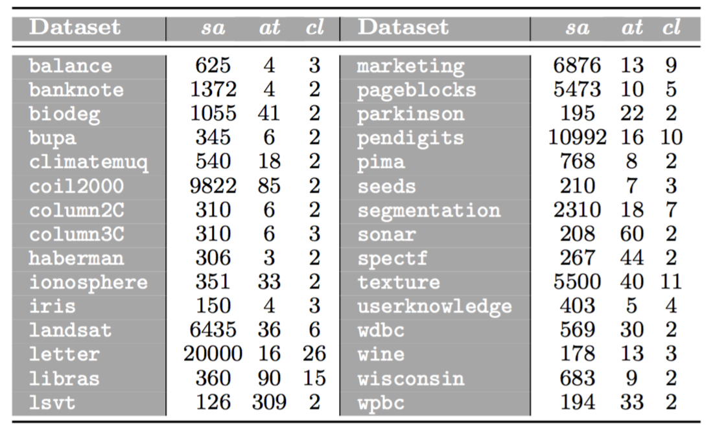

 

This webpage contains complementary material to the research paper:

| | |
|:---:|:---|
||[J. Sáez, E. Corchado, ANCES: A novel method to repair attribute noise in classification problems, Pattern Recognition 121 (2022) 108198.](https://doi.org/10.1016/j.patcog.2021.108198)|
| | |

 

The web is organized according to the following summary:

1. [Abstract](#Abstract)
2. [Datasets](#Datasets)
	- [Real-world datasets](#Realworld)
	- [Synthetic datasets](#Synthetic)
3. [Performance results](#Performance)

 
 
##  1. Abstract
Noise negatively affects the complexity and performance of models built in classification problems. The most common approach to mitigate its consequences is the usage of preprocessing techniques, known as noise filters, which are designed to remove noisy samples from the training data. Nevertheless, they are specifically oriented to deal with errors affecting class labels. Their employment may not always result in an improvement when noise affects attribute values. In these cases, correcting the errors is an interesting alternative to traditional noise filtering that has not been enough studied so far in the specialized literature. This research proposes an attribute noise correction method with the final aim of increasing the performance of the classification algorithms used later. The identification of noisy data is based on an error score assigned to each one of the attribute values in the dataset, which are then passed through an optimization process to correct their potential noise. The validity of the proposed method is studied in an exhaustive experimental study, in which it is compared to several well-known preprocessing methods to deal with noisy datasets. The results obtained show the suitability of attribute noise correction with respect to the other alternatives when data suffer from attribute noise.

 
 
##  2. Datasets

###  2.1. Real-world datasets

The experimentation is based on 30 real-world datasets, in which attribute noise is introduced. The following table shows these datasets, where *sa* refers to the number of samples, *at* to the number of attributes and *cl* to the number of classes. Samples containing missing values are removed from the datasets before their usage.

These datasets can be downloaded from the webpage of the [UCI Machine Learning Repository](https://archive.ics.uci.edu/ml/index.php).

 

###  2.2. Synthetic datasets

The sensitivity analysis of parameters in ANCES has been performed using synthetic datasets. They have been created following the procedure proposed by Qiu and Joe (2006). Completely clean datasets (without noise, outliers or overlapping) are created considering a different number of classes (2, 5 and 8), attributes (10, 20 and 30) and samples (500, 750 and 1000). They are built completely balanced, that is, the samples are evenly distributed among the classes. The complete details about the data generation method and the source code used to generate the synthetic datasets can be downloaded below:

|||
|:---|:---:|
|**Description** |**File**|
|W. Qiu and H. Joe. **Generation of random clusters with specified degree of separation**. *Journal of Classification*, 23(2):315–334, 2006.| |
|Source code of the synthetic data generation method of Qiu and Joe (2006)| |
|||

 

##  3. Performance results

|||
|:---|:---:|
|&nbsp;&nbsp;&nbsp; *5% attribute noise* | |
|&nbsp;&nbsp;&nbsp; *10% attribute noise* | |
|&nbsp;&nbsp;&nbsp; *15% attribute noise* | |
|&nbsp;&nbsp;&nbsp; *20% attribute noise* | |
|&nbsp;&nbsp;&nbsp; *25% attribute noise* | |
|&nbsp;&nbsp;&nbsp; *30% attribute noise* | |
|&nbsp;&nbsp;&nbsp; *35% attribute noise* | |
|&nbsp;&nbsp;&nbsp; *40% attribute noise* | |
|||
